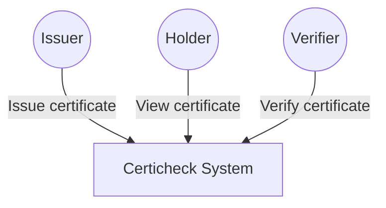
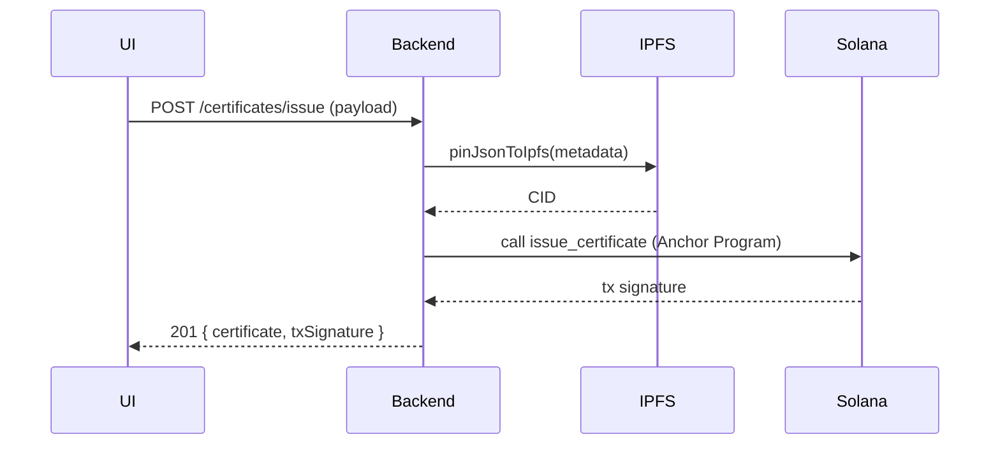
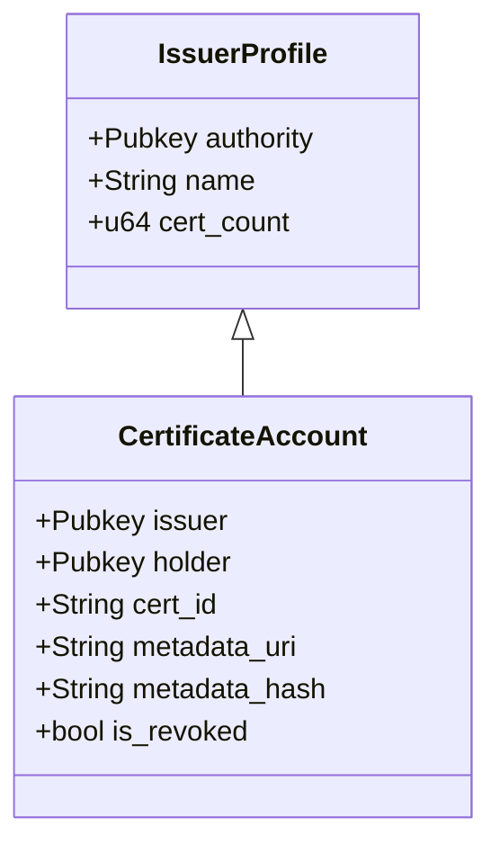

## Figure 3.1 — Use Case Diagram

```mermaid
%% Use case diagram
graph TD
  Issuer((Issuer))
  Holder((Holder))
  Verifier((Verifier))
  System[Certicheck System]

  Issuer -->|Issue certificate| System
  Holder -->|View certificate| System
  Verifier -->|Verify certificate| System
```

## Figure 3.2 — Sequence Diagram (Issuance)

```mermaid
sequenceDiagram
  participant UI
  participant Backend
  participant IPFS
  participant Solana

  UI->>Backend: POST /certificates/issue (payload)
  Backend->>IPFS: pinJsonToIpfs(metadata)
  IPFS-->>Backend: CID
  Backend->>Solana: call issue_certificate (Anchor Program)
  Solana-->>Backend: tx signature
  Backend-->>UI: 201 { certificate, txSignature }
```

## Figure 3.3 — Class Diagram (Simplified)

```mermaid
classDiagram
  class CertificateAccount {
    +Pubkey issuer
    +Pubkey holder
    +String cert_id
    +String metadata_uri
    +String metadata_hash
    +bool is_revoked
  }

  class IssuerProfile {
    +Pubkey authority
    +String name
    +u64 cert_count
  }

  IssuerProfile <|-- CertificateAccount
```
